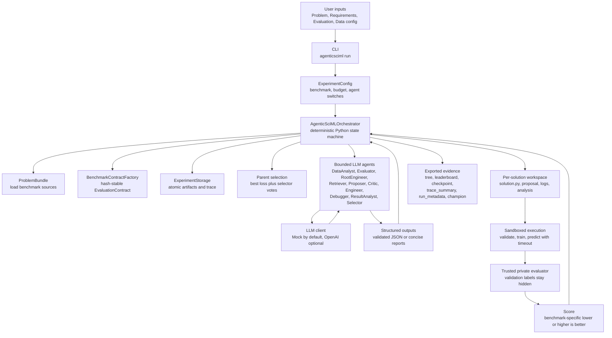
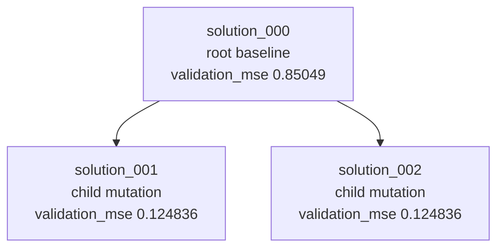

# 导师进度汇报图与架构说明

[返回文档树](index.md) · 相关文档：[项目概览](../README.md)、[版本说明](version_notes.md)、[Benchmark 与实验设计](benchmark_plan.md)

## 汇报口径

当前项目已经完成 AgenticSciML workflow 的工程复现 MVP。可以汇报的是：

- 多 Agent solution-tree workflow 已经能在本地 mock 模式跑通。
- 每次 run 都会留下 prompt、response、score、trace、checkpoint、leaderboard 和 champion artifact。
- 当前 benchmark 覆盖 6 个论文任务家族的本地 `proxy`，另有 2 个 `faithful-small` 升级：S1.1 不连续函数逼近和 S1.2 L-shaped Poisson。
- 目标是复刻流程与证据链，不是复现论文分数。

不建议汇报为：

- 已复现论文中的 improvement factor。
- 已完成 paper-like 大预算 SciML 实验。
- mock/proxy 分数已经支持科学发现结论。

## 图 1：当前 Workflow 架构



这张图的重点是：**全局控制权在 Python orchestrator，不在 LLM 群聊里**。LLM 只作为有边界的生成、评审、修复和总结工具；状态转移、评分、排序、checkpoint、trace 和 artifact 写入都由 deterministic Python 负责。

## 图 2：当前 Mock Run 的 Solution Tree

这张图来自本地验证 run：

```bash
PYTHONPATH=src uv run --python 3.11 --extra dev python -m agenticsciml.cli run examples/function_approx --mock --max-iterations 1 --experiment-id codex-run-check --output-dir runs
```

`function_approx` 的指标是 `validation_mse`，越低越好。



可以这样解释：系统先生成 root baseline，然后从 root fanout 出两个 child mutation。两个 child 都比 root 的 mock score 更低，说明当前流程已经能展示 solution-tree expansion、mutation、evaluation 和 leaderboard 更新。

这张图只说明 workflow 跑通和 artifact 形状正确，不说明真实 LLM 在 SciML 任务上已经产生论文级提升。

## 图 3：当前能力矩阵

```mermaid
flowchart LR
  subgraph done["已可展示"]
    d1["Mock workflow<br/>root plus mutation"]
    d2["8 benchmark catalog entries<br/>6 proxy plus 2 faithful-small"]
    d3["Artifact persistence<br/>prompt, response, score, logs"]
    d4["Trace quality gate<br/>artifact consistency checks"]
    d5["Checkpoint and resume<br/>fail-closed validation"]
    d6["Mock ablation outputs<br/>runs, summary, report"]
  end

  subgraph partial["部分完成"]
    p1["Real LLM mode<br/>adapter and smoke tooling exist"]
    p2["faithful-small benchmarks<br/>closer task structure, low budget"]
    p3["Local sandbox<br/>static guardrails, not container isolation"]
    p4["Branch-context comparison<br/>dry-run and verifier scaffold"]
  end

  subgraph next["下一步"]
    n1["Real LLM smoke<br/>branch vs no-branch"]
    n2["Multi-seed real ablation<br/>KB, no-KB, no-critic, no-debugger"]
    n3["Paper-like benchmarks<br/>larger SciML data and training budget"]
    n4["Publication-style plots<br/>curves, ablation bars, benchmark panels"]
  end

  done --> partial --> next
```



这张图适合放在汇报最后，用来说明项目不是只写了代码框架，而是已经有可运行证据；同时也明确后续距离论文结果图还差真实 LLM、多 seed 和更高 fidelity benchmark。

## 当前架构怎么理解

一句话概括：**这是一个 artifact-first 的多 Agent 进化搜索系统，Python 管状态，LLM 管局部判断和代码生成。**

核心链路如下：

1. CLI 读取 benchmark 和预算配置，创建 `ExperimentConfig`。
2. `AgenticSciMLOrchestrator` 加载 `ProblemBundle`，由 Evaluator 生成并持久化 `EvaluationContract`。
3. RootEngineer 生成 `solution_000`，Runner 在隔离 workspace 中执行 validate、train、predict。
4. Trusted evaluator 使用私有验证标签计算 score，generated `solution.py` 只看到训练数据和 `x_val`。
5. 父节点选择先保留 best-loss solution，再用 Selector votes 选 exploration parents，不足时由 deterministic SearchPolicy 补齐；Retriever / Proposer / Critic / Engineer 生成 child mutation。
6. Debugger 在限定次数内修复失败 child；ResultAnalyst 总结每个 solution。
7. Storage 写入 checkpoint、trace、leaderboard、tree 和 champion。
8. Trace summary 对完成态 run 做 quality gate，检查事件、node reference、artifact 和 contract 是否一致。

导师可能会问的关键问题：

- **为什么不是 LLM 自由讨论？** 因为论文 workflow 要可审计、可恢复、可评分；当前实现用 Python 固定状态机，降低不可控性。
- **怎么防止验证集泄漏？** 采用 prediction-only evaluation：generated code 只输出预测，私有 evaluator 才接触验证标签。
- **怎么证明一次 run 可信？** 看 `trace_summary.json` 的 `quality_gate.passed` 和 `artifact_consistency.passed`，再看 `leaderboard.csv`、`tree.json`、`checkpoint.json`。
- **现在离论文结果差什么？** 真实 LLM、多 seed ablation、paper-like benchmark 数据和训练预算、正式 plotting 脚本。

## 汇报开场建议

可以这样开始：

> 我目前完成的是 AgenticSciML 的工程复现 MVP。它不宣称复现论文分数，而是先把论文里的多 Agent solution-tree workflow 做成可运行、可审计、可恢复的系统。现在本地 mock 模式可以跑通 root generation、child mutation、evaluation、trace quality gate 和 champion export；下一阶段是接真实 LLM 做多 seed 消融，再升级 benchmark fidelity。
